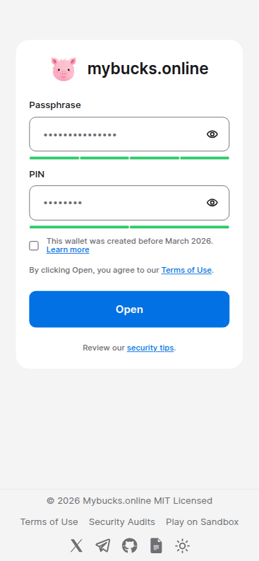
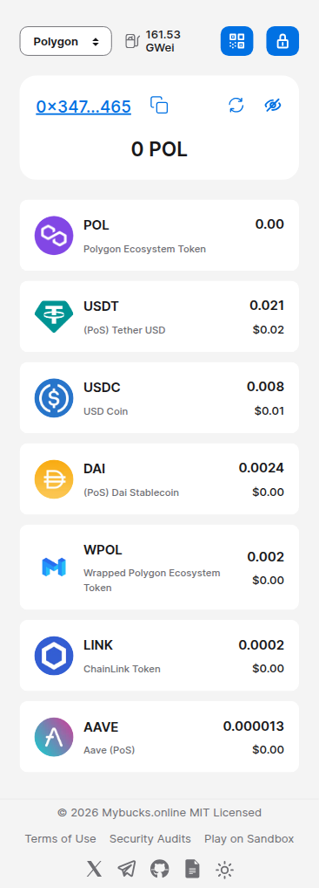
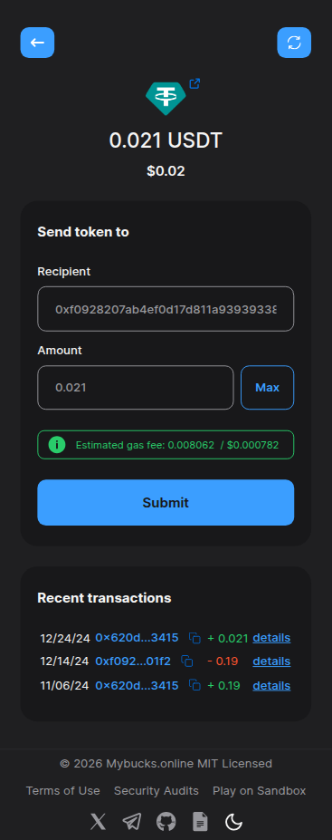
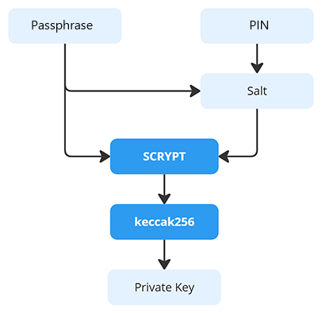

# mybucks.online

This is a source repository of [app.mybucks.online](https://app.mybucks.online).

[Mybucks.online](https://mybucks.online) is a **seedless, disposable crypto wallet** designed for **speed and convenience**. It generates a private key from your password and passcode using an industry-standard, verified **one-way hash function**. Your private key forms your account, allowing you to transfer, receive, and hold your crypto assets instantly.

As a hash function, the **Scrypt** Key Derivation Function (KDF) increases the computational effort required to crack passwords, effectively delaying **brute-force** attacks and making them impractical.

It fully runs on your **browser side** without using any storage or invoking any 3rd-party APIs for key management. It instantly generates your private key from your password input, and whenever you close or refresh, there is **no footprint**. This absolutely protects your privacy.

### Zero Footprint  
- No servers, no databases, no storage and no tracking.
- 100% browser-based.
- Your credentials never leave your device.
- Your account is generated whenever you open it. Closing or refreshing your browser erases all traces/history.

### Fast and Easy
- No app installs, no browser extensions, no registration and no KYC.
- You can create or open your wallet in seconds - all you need is your browser.
- Password is easier to handle and remember than seed phrases

### 1-Click Gifting
- Stop asking your friends for their wallet addresses.
- Send a wallet as a URL rather than just sending coins.
- The recipient clicks the URL and takes full ownership instantly.
- This makes **gifting or airdropping perfectly easy** and enables massive micro-gifting in seconds.

## How to Use

1. Visit [app.mybucks.online](https://app.mybucks.online).
2. Input your password and passcode.  
  Test credentials:  
    password: **DemoAccount5&**  
    passcode: **112324**
3. Click `Open`.

(This process is the same for both initial opening and all subsequent uses.)


<p align="center">



</p>

## How it works?
The **Scrypt** and **Keccak256** hash functions turn your credentials into a private key. The Scrypt KDF(Key Derivation Function) requires significant memory to compute, making brute-force attacks computationally expensive and impractical.



## Generate the private key

This demonstrates how to generate a private key from your `password` and `passcode` and helps you understand the process.

```javascript
import { Buffer } from "buffer";
import { ethers } from "ethers";
import { scrypt } from "scrypt-js";

const HASH_OPTIONS = {
  N: 32768, // CPU/memory cost parameter, 2^15
  r: 8, // block size parameter
  p: 5, // parallelization parameter
  keyLen: 64,
};

// password: at least 12 characters user input, lowercase, uppercase, digits, and special characters
// passcode: at least 6 characters
async function generatePrivateKey(password, passcode) {
  const salt = `${password.slice(-4)}${passcode}`

  const passwordBuffer = Buffer.from(password);
  const saltBuffer = Buffer.from(salt);

  const hashBuffer = await scrypt(
    passwordBuffer,
    saltBuffer,
    HASH_OPTIONS.N,
    HASH_OPTIONS.r,
    HASH_OPTIONS.p,
    HASH_OPTIONS.keyLen,
    (p) => console.log(Math.floor(p * 100))
  );
  const hashHex = Buffer.from(hashBuffer).toString("hex");
  const privateKey = ethers.keccak256(abi.encode(["string"], [hashHex]));

  return privateKey;
}
```

## @mybucks.online/core

The core components responsible for hash and private key generation, generate & parse transfer-link token have been extracted into an independent package. You can explore the details of this package [here](https://www.npmjs.com/package/@mybucks.online/core).

```
npm install @mybucks.online/core
```

## Transfer a wallet via URL 🎁🎁🎁

With mybucks.online, you can send cryptocurrency and even **wallet itself via a URL**. The recipient simply clicks the link to open the wallet and take full ownership.

Try this link:  
https://app.mybucks.online/?wallet=VWnsSGRGVtb0FjY291bnQ1JgIxMTIzMjQCb3B0aW1pc20=_wNovT

This feature allows you to **create a one-time wallet** and put stablecoins or memecoins into it. You can **transfer full ownership as a gift without ever asking for a recipient's address**. These serve as a "starter" wallet for the recipients, who can then easily withdraw the funds into their own personal pockets or primary wallets.

This is a powerful tool for **bulk distribution** and **massive airdrops** to many people simultaneously. You no longer need to ask for a wallet address or force users to connect their wallet to your app for a small $5 referral fee. You simply share the unique links through any messaging platform, social media, or email.

## Major dependencies

This project uses the following major dependencies:

- **scrypt-js**  
  Implements the `scrypt` hash function. Please check the npm registry [here](https://www.npmjs.com/package/scrypt-js).
- **ethers**  
  A standard library for manipulating EVM accounts.
- **moralis**  
  Provides query functions for massive crypto assets in multiple networks.
- **@uniswap/default-token-list**  
  ERC20 tokens are filtered to only display those included in the Uniswap default token list.
- **tronweb**
- **styled-components**

## How to Run

Please sign up for [Infura](https://infura.io), [Moralis](https://moralis.com/) and [Trongrid](https://trongrid.io/), create free API keys, and update the environment variables accordingly.

```bash
yarn install
cp .env.example .env
# Update the .env variables with valid keys
yarn dev
```

## Production Environment

The project is deployed via GitHub Pages and GitHub Actions. You can verify the deployment and DNS configuration:

- [Actions](https://github.com/mybucks-online/app/actions)
- [Releases](https://github.com/mybucks-online/app/releases)
- DNS: `app.mybucks.online` → `mybucks-online.github.io`

## Quick Links

- App: https://app.mybucks.online
- Website: https://mybucks.online
- Docs: https://docs.mybucks.online
- Github: https://github.com/mybucks-online
- X: https://x.com/mybucks_online
- Telegram: https://t.me/mybucks_online
- Audit report: https://app.secure3.io/5c92d55acd
